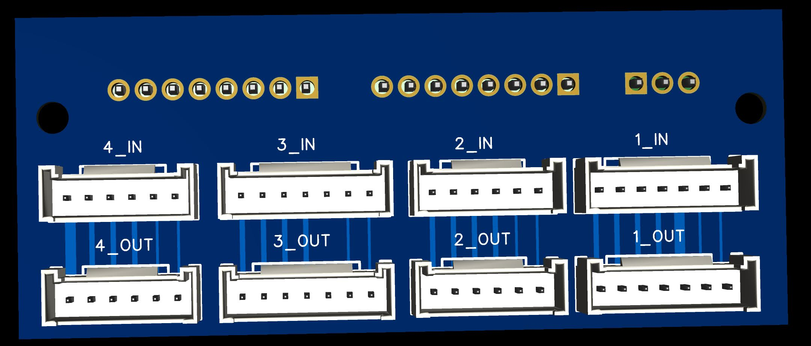
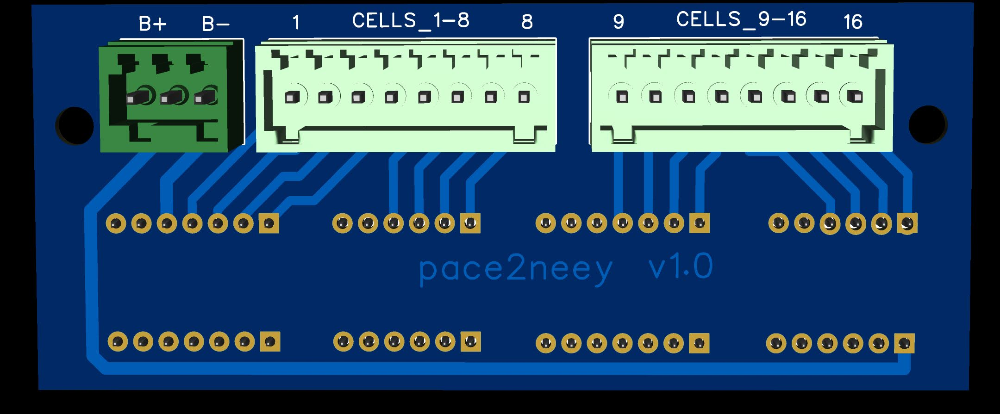
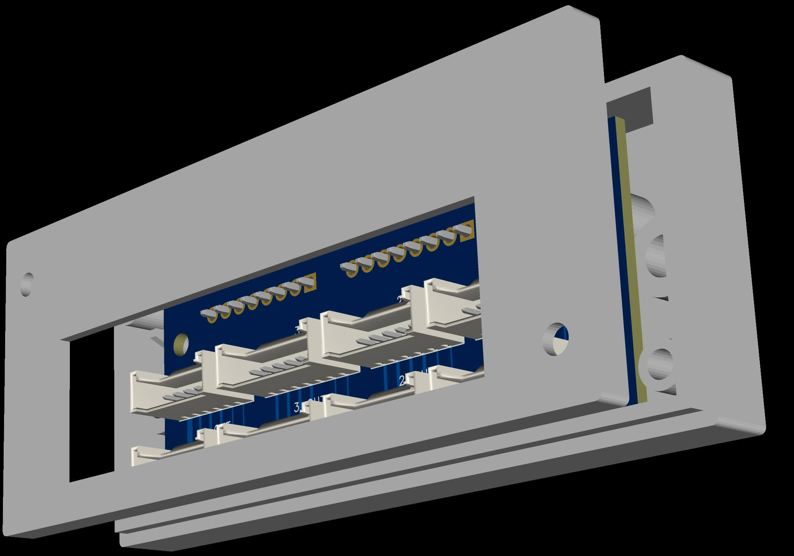
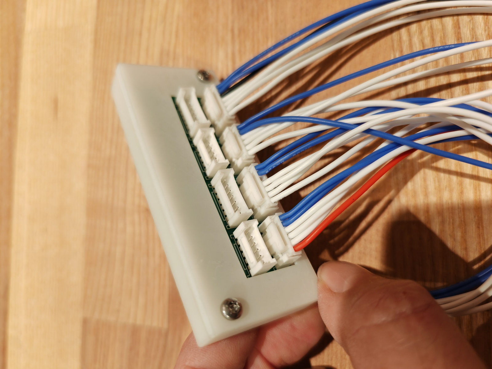

# pace2neey

This adapter can be used to connect any active balancer to the Pace P16S200A BMS.






Please find more images in the ```img``` folder.

# PCB

The PCB was designed with EasyEDA Pro (https://easyeda.com/page/download) and ordered @ https://jlcpcb.com/
See folder ```gerber```

# Case

The PCB was also designed with EasyEDA Pro (https://easyeda.com/page/download) and also ordered @ https://jlcpcb.com/
See folder ```case```

# Cables

Cables are DIY or you could order custom cables @ https://www.lcsc.com/newservice?utm_source=newservice&utm_medium=navbar
I never tested this service @lcsc so any feedback regarding this cable service is very welcome.

# Components

## PCB Components
All PCB Components have been ordered @ https://www.lcsc.com/

- 1x DIBO DB2EK-2.54-3P-GN-S (https://www.lcsc.com/product-detail/Pluggable-System-Terminal-Block_DIBO-DB2EK-2-54-3P-GN-S_C2927484.html)
- 2x DIBO DB2EK-2.54-3P-GN-S (https://www.lcsc.com/product-detail/Pluggable-System-Terminal-Block_DIBO-DB2EK-2-54-8P-GN-S_C2927489.html)
- 4x HCTL HC-HY-7A (https://www.lcsc.com/product-detail/Wire-To-Board-Wire-To-Wire-Connector_HCTL-HC-HY-7A_C2845465.html)
- 4x HCTL HC-HY-6A (https://www.lcsc.com/product-detail/Wire-To-Board-Wire-To-Wire-Connector_HCTL-HC-HY-6A_C2845464.html)

## Cable Components

- 4x HCTL HC-HY-6Y (https://www.lcsc.com/product-detail/Rectangular-Connectors-Housings_HCTL-HC-HY-6Y_C2962321.html)
- 4x HCTL HC-HY-7Y (https://www.lcsc.com/product-detail/Rectangular-Connectors-Housings_HCTL-HC-HY-7Y_C2962322.html)
- 52x HCTL HC-HY-T (https://www.lcsc.com/product-detail/Line-Pressing-Terminals_HCTL-HC-HY-T_C2962332.html)
- AWG 24 Cable (eg. https://amzn.eu/d/fyN3sxU)

## Case Components

- 6x M3 Screws
- 2x Thread insert (eg. https://amzn.eu/d/4u7W0dZ)

# Tools

- Soldering Iron
- Solder
- ENGINEER PA-24 Micro Connector Crimping Pliers (DIY cables)
- Knipex KN 12 42 195 (DIY cables)


# changelog

2023-11-07  v1.0  first version